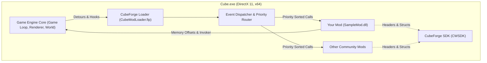
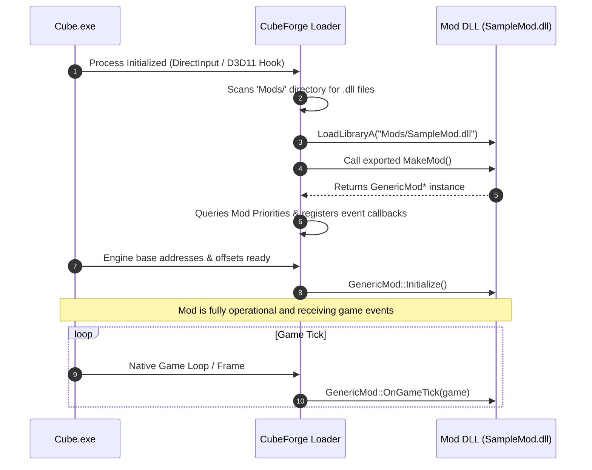
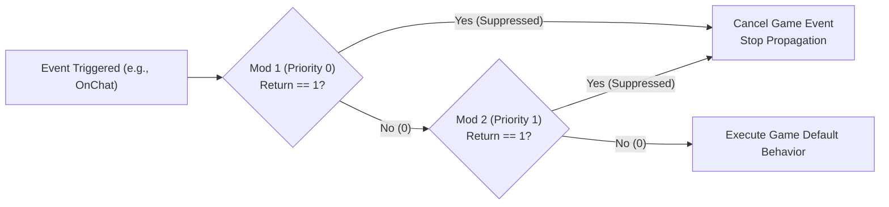

# CubeForge Modding Architecture

A technical deep dive into how native C++20 mods interact with the Cube World engine, `CubeForge Loader`, and `CubeForge SDK`.

---

## 🧭 Table of Contents

1. [System Overview](#1-system-overview)
2. [Mod Loading Lifecycle](#2-mod-loading-lifecycle)
3. [The VTable Dispatcher & Priority Model](#3-the-vtable-dispatcher--priority-model)
4. [Memory Layout & Reverse-Engineered Types](#4-memory-layout--reverse-engineered-types)
5. [Threading Model & Synchronization](#5-threading-model--synchronization)
6. [ABI Compatibility & Compiler Constraints](#6-abi-compatibility--compiler-constraints)

---

## 1. System Overview

Cube World does not feature an official modding API. Modding is achieved via **native dynamic-link library (DLL) injection** and virtual method table (VTable) interception.



---

## 2. Mod Loading Lifecycle

When Cube World starts, the loading flow executes in four distinct phases:



### Phase 1: DLL Discovery & Instantiation
1. `CubeForge Loader` scans the `Mods/` directory for 64-bit DLLs.
2. It loads each DLL via `LoadLibraryA`.
3. It locates the exported factory function `MakeMod()` with C linkage:
   ```cpp
   EXPORT GenericMod* MakeMod() {
       return new SampleMod();
   }
   ```
4. `MakeMod()` instantiates your mod class, which inherits from `GenericMod`.

### Phase 2: Priority Registration
The loader inspects the priority values assigned in your mod's constructor (e.g., `OnChatPriority = HighPriority;`) and registers your callbacks in the global event routing table.

### Phase 3: Post-Base Address Initialization
Once the game base address (`CWBase()`) and internal offsets (`CWOffset()`) are verified, `Loader` calls `GenericMod::Initialize()`.

---

## 3. The VTable Dispatcher & Priority Model

When multiple mods are installed, they often hook the same game events (e.g., chat messages or creature stat recalculation). `CubeForge Loader` executes callbacks in **strict priority order**:

| Priority Level | Value | Intended Purpose |
| :--- | :---: | :--- |
| `VeryHighPriority` | `0` | Interceptors that must inspect/modify data before anyone else. |
| `HighPriority` | `1` | Command parsers, security filters, or priority overrides. |
| `NormalPriority` | `2` | Standard game logic, stat adjustments, general mod mechanics (Default). |
| `LowPriority` | `3` | Secondary modifiers that depend on base recalculations. |
| `VeryLowPriority` | `4` | Telemetry, logging, UI display, and passive observers. |

### Event Suppression Flow


---

## 4. Memory Layout & Reverse-Engineered Types

Cube World data structures are reconstructed inside `CubeForge SDK` (`cwsdk.h`).

### Core Struct Relationships:
- **`cube::Game`**: The root singleton representing the active game instance. Contains pointers to `world`, `gui`, `renderer`, `client`, `host`, and `controls`.
- **`cube::World`**: Manages active chunks, regions, map data, and all loaded entities (`creatures`).
- **`cube::Creature`**: Represents any character, player, companion, or hostile monster in the world. Includes `entity_data` (HP, MP, class, level, position) and `equipment`.
- **`cube::Item`**: Represents equipment, consumables, crafting ingredients, and quest artifacts.

---

## 5. Threading Model & Synchronization

Cube World uses multi-threading to handle chunk remeshing, zone generation, and network packets:

- **Main Thread**: Runs the game loop, UI rendering, input capture, and `OnGameTick`.
- **Background Worker Threads**: Generate new voxel zones and calculate mesh LODs (`OnZoneGenerated`, `OnChunkRemesh`).

> [!CAUTION]
> **Thread Safety**: Accessing `game->world->creatures` or `game->world->zones` from background threads or asynchronous tasks without locking can cause race conditions and CTDs (Crash to Desktop).
> Always use `CriticalSectionGuard` when accessing shared world collections:
> ```cpp
> {
>     CriticalSectionGuard lock(game->world->zones_critical_section);
>     // Thread-safe operations
> }
> ```

---

## 6. ABI Compatibility & Compiler Constraints

To ensure crash-free execution, mods must conform to the exact memory alignment and runtime characteristics of Cube World's binary:

1. **64-bit Architecture (`x64`)**: The game is a 64-bit executable.
2. **`_ITERATOR_DEBUG_LEVEL = 0`**: Cube World was compiled in MSVC Release mode. If a mod is compiled with `_ITERATOR_DEBUG_LEVEL != 0`, STL objects (`std::string`, `std::vector`, `std::map`) have different byte sizes, causing immediate memory corruption upon cross-boundary exchange.
3. **C++20 Standard**: Modern language features, concepts, and standard library utilities.
4. **DirectInput 8**: Key states and controller arrays require `DIRECTINPUT_VERSION=0x0800`.
